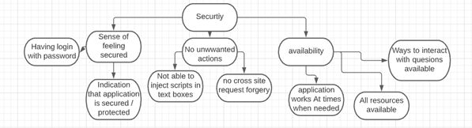

# Design document draft

## Group 72

### Introduction

The following paper will consist of two parts, the first one being Human-Computer Interaction (HCI). Here we will elaborate on how we will test our application and also give an extensive evaluation. The second part will be about responsible computer science and here we will answer the question: &#39;in what way would our design process and final product change if we also had to design our product for one additional value of a &quot;non-obvious&quot; stakeholder?&#39;.

### Human-Computer Interaction

#### Introduction

Human-Computer Interaction, also known as the abbreviation &#39;HCI&#39;, is exactly what you expect it to be. It is a discipline in information science which researches the interaction between users (human) and machine (computer). This is usually done through an interface. The objective of this evaluation is to gain knowledge on the pitfalls and hindrances of our application, as well as the things that are going well. All this information will be taken into account and processed, so that we can improve and change the application where needed. The current state of our project is the database is designed and implemented and we also have working endpoints. As far as for the frontend we have finalized prototype views and are currently busy with creating the real views. The evaluators will get a working prototype including the instructions.

#### Methods

##### Experts

The experts for this research consist of peers of the study Computer Science and Engineering attending the Delft University of Technology. For this evaluation we will be working with 6 evaluators in total. The level of their expertise is expected to be on the same level as a first-year computer science student. This means that they themselves already at least have sufficient knowledge.

##### Procedure

For the procedure we will provide all the evaluators with a working prototype. In addition to the working prototype we will also include a text file containing a step-by-step guide on what they need to do. First the evaluators will start by running the Java client file. Once running, they will interact with the application as if they were a user. In the text file we provide we go over steps that they need to perform. They will start by joining a lobby and asking and deleting questions. Along with this they will also try to upvote questions. Once they finished these tasks, they will start the moderator tasks which requires joining a lobby as a moderator. Here they will mark questions as answered, delete questions and answer questions. Furthermore, they will also have a look at the simplified view (the presenter view). In the end, they will perform the final task which is closing a lecture. During these steps they will write their issues and comments down. They will be asked to categorize their findings in the ten heuristics that we provide. The ten usability heuristics are the same as those defined by Jakob Nielsen (1994).

Once they finish their evaluation and went over all the steps they will be asked to when needed elaborate on additional (non-critical) issues of our application which don&#39;t fit with the 10 heuristics provided.

#### Measures

The evaluators write down the issues they find and also additional comments. Once we have collected all the evaluations, the issues will be put inside a table together with the frequency. Additionally, we will also provide a severity of the issue ourselves. Meaning we can categorize the issues not only for their frequency but also for their severity. This gives a good indication on how critical an issue is. On top of that it&#39;s also a good indicator on what we need to work on first and improve. In a nutshell all the issues will be put inside a table together with their frequency and severity.

#### Results

Here we will provide the results

#### Conclusion

Inside the conclusion we plan on showing our design before the evaluation and after the evaluation. This will give a good idea on how we improved our results from the improvement points we got.

### Responsible computer science

In what way would our design process and final product change if we also had to design our product for one additional value of a &#39;non-obvious&#39; stakeholder

#### Table containing the 8 stakeholders

| Direct | Indirect |
| --- | --- |
| Student User | University |
| Lecturer User | Government |
| Designer | Family |
| Maintainers | |

#### Choice of the non-obvious stakeholder

We chose to go with the non-obvious stakeholder government. The reason for this is because we were interested to see what ethnic values are related to the government and this project in special.

**Elaborate more on this**

#### Three ethically relevant issues

The three ethical values that we chose are security, mutual benefit and reliability. We believe these are important to the stakeholder especially in the context of our product. A report from comparitech by Sam Cook (2020) stated that in the last 15 years more than 24 million US school records have been leaked. Keeping sensitive information in mind and how to protect it is a very important ethical value, namely security. A breach can be very bad for the government this is why this is a value that is very relevant for the project. Governments spend a lot of capital money on higher education. A part of this money goes to paying teachers, but also a big part of the money goes to the innovations and applications. It would be very beneficial for the government to know if the application will actually be beneficial otherwise it could be seen as lost money and that is something to avoid. Therefore, the value mutual benefit is also of great importance. How reliable is the application? Will it always work? Does it work when a lot of concurrent students are using the applications? All these questions relate to the reliability of the application. This is a very important value for the government. Because everything that directly influences the University indirectly influences the government.

#### Security

Security is one of the basic needs of humanity. In relation to our application this means that unauthorized people can&#39;t attain information on students, lectures and moderators. Furthermore, there should also be no option for users to harm other users. According to van den Hoven (2008) Personal data is defined in the law as data that can be linked with a natural person. Considering this application will be for university students and they will connect with a username there is a possibility leaked information can be linked to a person. For the government security is a very important value, because a leak could result in unforeseen damages (van den Hoven, Weckert).

#### What to learn

To gain a better insight on the topic security keeping in mind the stakeholder, we will conduct a heuristic evaluation with experts on the field of this topic. Next to this we would contact multiple cybersecurity specialist with expertise in the field application building and software management. (these are hypothetical steps that we would do to make sure that the value security will be integrated into our project feel free to extend this!!!)

#### Value hierarchy

#### Design changes

On one hand we have the advocation of security from the stakeholder government, while on the other hand the client wants a not too complicated application. One of the requirements of the client was that there would be no authentication process this contradicts the recommendation of having a login and password for security reasons. We can try to solve this conflict by creating a application that will be secure without the need for passwords.

#### References

Nielsen, J. (1994). 10 Usability Heuristics for User Interface Design. [https://www.nngroup.com/articles/ten-usability-heuristics/](https://www.nngroup.com/articles/ten-usability-heuristics/)

Cook, S. (2020). US schools leaked 24.5 million records in 1,327 data breaches since 2005. [https://www.comparitech.com/blog/vpn-privacy/us-schools-data-breaches/](https://www.comparitech.com/blog/vpn-privacy/us-schools-data-breaches/)

van den Hoven J. &amp; Weckert J. (2008). Information technology, privacy, and the protection of personal data. _Information technology and moral philosophy_, Cambridge: Cambridge University Press, pp. 301–322.