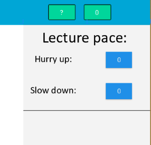
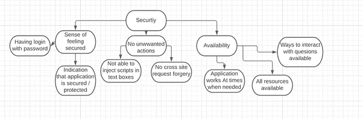

# Design document 

## Group 72

### Introduction

The following paper will consist of two parts, the first one being Human-Computer Interaction (HCI). Here we will elaborate on how we will test our application and also give an extensive evaluation. The second part will be about responsible computer science and here we will answer the question: &#39;in what way would our design process and final product change if we also had to design our product for one additional value of a &quot;non-obvious&quot; stakeholder?&#39;.

### Human-Computer Interaction

#### Introduction

Human-Computer Interaction, also known as the abbreviation &#39;HCI&#39;, is exactly what you expect it to be. It is a discipline in information science which researches the interaction between users (human) and machine (computer). This is usually done through an interface. The objective of this evaluation is to gain knowledge on the pitfalls and hindrances of our application, as well as the things that are going well. This evaluation allows us to evaluate and improve our project. We won't be the only ones doing this since we have the help of 6 experts. The experts will also evaluate our project and give feedback. All this information will be taken into account and processed, so that we can improve and change the application where needed. The current state of our project is the database is designed and implemented and we also have all our endpoints working. The client side has also been finiliazed and all the views are working with the desired interactivity.

#### Methods

##### Experts

The experts for this research consist of peers of the study Computer Science and Engineering attending the Delft University of Technology. For this evaluation we will be working with 6 evaluators in total. These are not novice people and their expertise is expected to be on the same level as a first-year computer science student. This means that they can give valuable insights, relevant feedback and further improvements where needed.
##### Procedure

For the procedure we will provide all the evaluators with a working application. The way the evaluations will be held will be as following. The evaluator gets in a discord call with one of the project team members. Here the team member will explain the steps that the evaluator will take. Once explained all the freedom will be with the evaluator on how to interact with the program. The evaluator will go from creating a room to joining a room and asking / deleting questions. Furthermore they will also look and all the views and use all the functionality. In the end, they will perform the final task which is closing a lecture. During the evaluation they will be asked to categorize their findings (issues) in the ten heuristics questionnaire that we provide. The ten usability heuristics are the same as those defined by Jakob Nielsen (1994). The questionnaire contains the ten usability heuristics and for each heuristic there is a scale of agreement. The evaluator will indicate how well the project adheres to that heuristic. At the end of the questionnaire the evaluator has the opportunity to give additional feedback.

#### Measures

The evaluators will have filled in a questionnaire with the issues they found, additional feedback and also how well we follow the heuristic values. So for every evaluator we have a pdf file containing their scaling of agreement for the heuristic values and also their feedback in text format. Next once we have collected all the evaluations, the issues that they found will be put inside a table together with the frequency in which these issues would occur. Additionally, we will also provide a severity of the issue ourselves. Meaning we can categorize the issues not only for their frequency but also for their severity. This gives a good indication on how critical an issue is. In addition we will also provide a bar graph which visually shows how well the heuristic values are implemented. In a nutshell all the issues will be put inside a table together with their frequency and severity and the heuristic values will be shown as a bar graph.
#### Results

We gave the evaluators the following questionnaire **add questionnaire**. All the evaluators filled this questionnaire and gave additional feedback. The results of the questionnaire will be displayed as a bar graph and the feedback will be put inside a frequency / severity table.

**questionnaire results**

%20
%20
%20
%20
%20

**feedback results**

The feedback on issues that the evaluators found will be shown here. First we identity all the issues they found and then we will put them in a severity matrix.
These are the issues that they found : 
more colours, writing to small, question box to big, students can’t be banned, non-intuitive filters, only upvote / downvote once, non-intuitive edit, no help page, lecture name not working, student count doesn’t work. We categorized all these issues the following: for every issue we first decided how frequent will this issue occur (the higher frequency the higher the number would be). After this we scaled the severity (the severer the issue the higher the number).
On the scale a 5,5 would mean that the issue is very frequent and very critical this would be a high severity question. The questions in the bottom left are low severity and the bottom right and top left are medium severity. Based on the severity we knew how fast we should fix the issue. Now follows the table we created to indicate these issues on their frequency / severitu.

#### Conclusion

From these results we derived certain improvement points. We made the question box resizeable. Next to that we also made sure that the lecture name and the student count were working. These issues were in the medium/ high severity ranking and we made sure to tackle them first. 
We also got working with the design of colours and styling. 

This is the changed view with colours

We also created an aditional functionality to further improve user freedom. We implemented a method which lets you export all the questions. These are the things where we got the chance to improve them. For further changes we could include a help document and extra documentation. 
Furthermore there is also room for improvement in the error prevention category. Here we could be more consise and cover more possible errors that can happen. The button for the help document would look something like this:

The following pictures show how the eventual product looks like. Here the changes we mentioned are already implemented 

**The student view**

**The Teacher view**

**The Assistant view**

**The login view**

### Responsible computer science

In what way would our design process and final product change if we also had to design our product for one additional value of a &#39;non-obvious&#39; stakeholder

#### Table containing the 8 stakeholders

| Direct | Indirect |
| --- | --- |
| Student User | University |
| Lecturer User | Government |
| Designer | Family |
| Maintainers | |

#### Choice of the non-obvious stakeholder

We chose to go with the non-obvious stakeholder government. The reason for this is that we were interested to see what ethic values are related to the government and this project in special. For the government, digital information management is something of great value. It creates the ability for the government to access, organize, create or share large quantities of data. This data can vary greatly based on importance, and can be as important as holding ones’ personal information. Many people with malicious intent can have different approaches to reach such volatile information whether it is remote intrusion, data mining or through malicious software. This is why government security is of such great importance and is the reason we choose it as our choice of the non-obvious stakeholder.

#### Three ethically relevant issues

The three ethical values that we chose are security, mutual benefit and reliability. We believe these are important to the stakeholder especially in the context of our product. A report from comparitech by Sam Cook (2020) stated that in the last 15 years more than 24 million US school records have been leaked. Keeping sensitive information in mind and how to protect it is a very important ethical value, namely security. A breach can be very bad for the government, resulting in this value being very relevant for our project. Governments spend a lot of capital money on higher education. A part of this money goes to paying teachers, but also a big part of the money goes to the innovations and applications. It would be very beneficial for the government to know if the application will actually be beneficial otherwise, it could be seen as lost money and that is something to avoid. Therefore, the value mutual benefit is also of great importance. How reliable is the application? Will it always work? Does it work when many concurrent students are using the applications? All these questions relate to the reliability of the application. This is a very important value for the government. Because everything that directly influences the University indirectly influences the government.

#### Security

In our context, we focus mainly on data security and it holds an immense importance to us. It refers to protecting our data from unauthorized access  that could lead to the data being tampered with or even corrupted. In relation to our application this means that unauthorized people can&#39;t attain information on students, lectures and moderators. Furthermore, there should also be no option for users to harm other users. According to van den Hoven (2008) Personal data is defined in the law as data that can be linked with a natural person. Considering this application will be for university students and they will connect with a username there is a possibility leaked information can be linked to a person. For the government security is a very important value, because a leak could result in unforeseen damages (van den Hoven, Weckert).

#### What to learn

To gain a better insight on the topic security keeping in mind the stakeholder, we will conduct a heuristic evaluation with experts on the field of this topic. Knowing the importance of security for our stakeholder, we would go even further and contact multiple cybersecurity specialist with expertise in the field application building and software management. We would also do an extensive research into the field of cybersecurity ourselves to get familiar with the topic by reading literature, learning about different types of cyberattacks etc. To end it off, we would try to get feedback on our program by testing if a trusted person or we ourselves could attempt to breach our programs' newly implemented security and attempt to find any exploit or approach to succeed in doing this. This would be a good form of test since the feedback would direct and specific for our program.

#### Value hierarchy

#### Design changes

On one hand, we have the importance of security from the stakeholder government, while on the other hand the client wants a not too complicated application. One of the requirements of the client was that there would be no authentication process this contradicts the recommendation of having a login and password for security reasons. We can try to solve this conflict by creating an application that will be secure without the need for passwords.

#### References

Nielsen, J. (1994). 10 Usability Heuristics for User Interface Design. [https://www.nngroup.com/articles/ten-usability-heuristics/](https://www.nngroup.com/articles/ten-usability-heuristics/)

Cook, S. (2020). US schools leaked 24.5 million records in 1,327 data breaches since 2005. [https://www.comparitech.com/blog/vpn-privacy/us-schools-data-breaches/](https://www.comparitech.com/blog/vpn-privacy/us-schools-data-breaches/)

van den Hoven J. &amp; Weckert J. (2008). Information technology, privacy, and the protection of personal data. _Information technology and moral philosophy_, Cambridge: Cambridge University Press, pp. 301–322.

